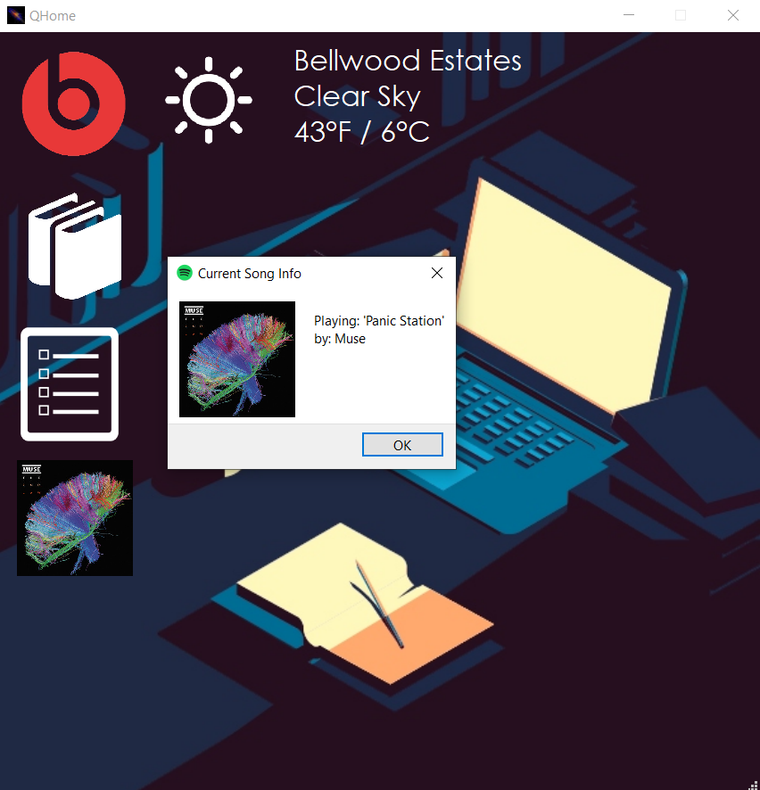
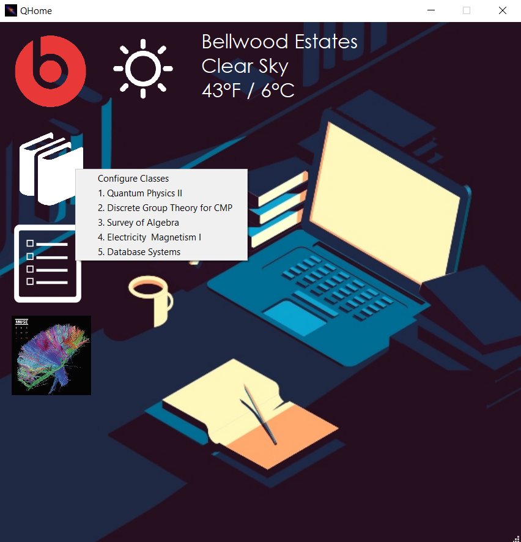

# QHome

QHome is a desktop application intended to bring multiple tasks that are done while studying/doing homework to one convient location. 
Features include: 
⋅ Display of current weather conditions for users current location.
⋅ Ability to connect to users Beats wireless headphones via bluetooth once device is found and saved.
⋅ Ability to create up to 6 course items that will open up various system files and webpages specified by the user 
⋅ Notepad to record various things for later lookup
⋅ Ability to control playback of users active spotify session such as playing/pausing current track, cahnging volume, skip to next/previous track, queue tracks from the user's playlists and getting information about user's currently playing track.

