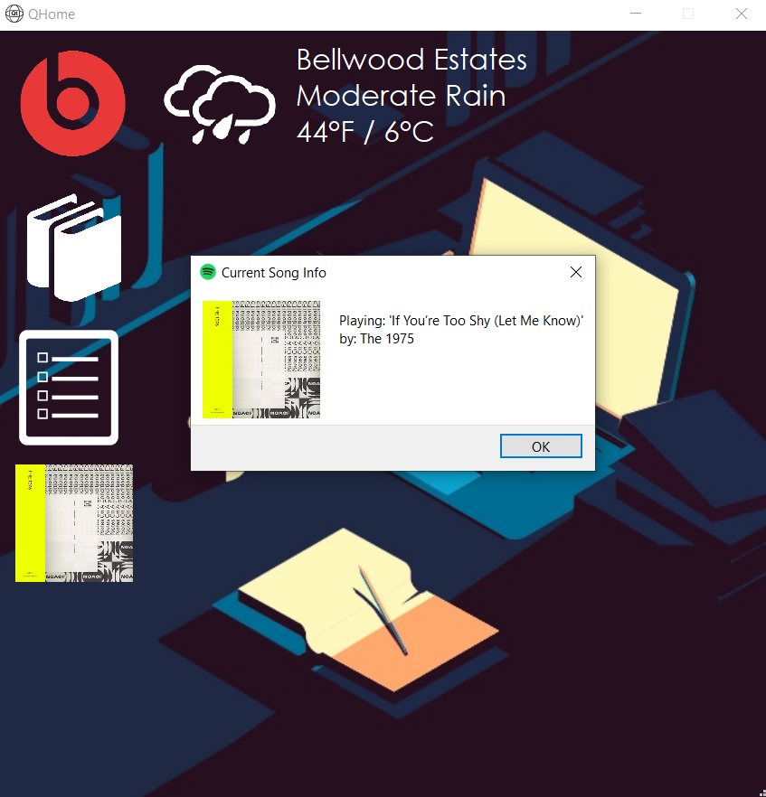

# QHome 

Demo Video: https://user-images.githubusercontent.com/56704119/110244234-bca23380-7f2b-11eb-8de2-945c19b1f425.mp4

QHome is a desktop application intended to bring multiple tasks that are done while studying/doing homework to one convenient location.   
Features include:   
  
⋅ Display of current weather conditions for users current location via the Open Weather API. 
   
⋅ Ability to connect to users Beats wireless headphones via bluetooth once device is found and saved.  
  
⋅ Ability to create up to 6 course items that will open up various system files and webpages specified by the user.  
  
⋅ Notepad to record various things for later lookup.  
  
⋅ Ability to control playback of user's active spotify session such as playing/pausing current track, changing volume, skip to next/previous track, queue tracks from the user's playlists and getting information about user's currently playing track all via the Spotify API.   
  
   

